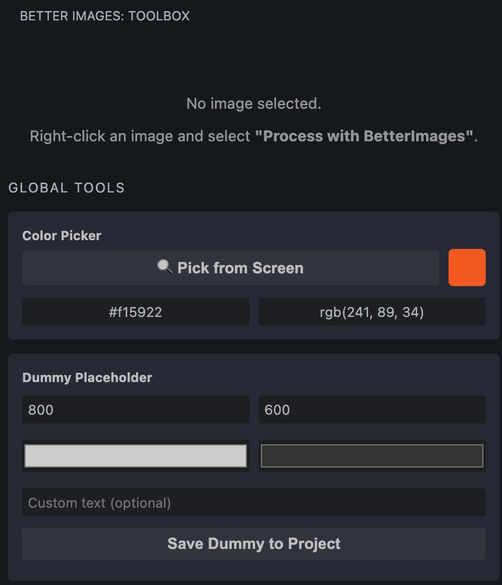
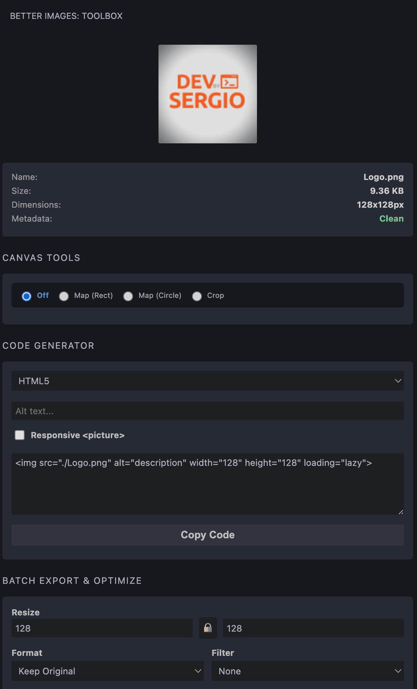

# BetterImages 📸

**BetterImages** is a professional image optimization and code generation suite designed for frontend developers who want to streamline their workflow and save time without leaving their editor.

Unlike web-based converters or heavy external software, **BetterImages works 100% locally**. Your images and data never leave your machine.

## ✨ Key Features

### 1. 💻 Framework-Aware Code Generation

Stop writing boilerplate image tags. Select an image, choose your framework, and instantly get production-ready code:

- **Next.js & Nuxt:** Auto-imports and generates optimized `<Image>` / `<NuxtImg>` components.
- **React, Astro, Vue & HTML5:** Automatically generates responsive `<picture>` wrappers and standard tags with dynamic width/height attributes.
- **Responsive Toggle:** Wrap any image in a `<picture>` tag ready for mobile assets with a single click.

### 2. 🎨 Interactive Canvas Tools

Draw directly on your images inside VS Code!

- **Image Map Generator:** Draw rectangles or perfect circles over your image to instantly generate `<map>` and `<area>` HTML coordinates. The code updates in real-time.
- **Crop Tool:** Visually drag a crop box and save a perfectly trimmed copy of your image directly into your workspace.

### 3. 🚀 Batch Export & Optimization Pipeline

A built-in powerhouse powered by `sharp`. Apply multiple transformations at once and export a single, perfect file:

- **Smart Resize:** Change dimensions with a built-in Aspect Ratio lock (🔒) to prevent distortion.
- **Next-Gen Formats:** Convert any image to **WebP** or **AVIF** with an adjustable quality slider (1% - 100%).
- **Metadata Stripper:** Automatically detects if your image has heavy EXIF data (GPS, Camera info) and strips it clean to save kilobytes.

### 4. ⚡ Global Developer Tools

Tools available at all times, even without selecting an image:

- **Favicon Generator:** One-click generation of `16x16`, `32x32`, and `180x180` Apple Touch icons, copying the required HTML `<link>` tags straight to your clipboard.
- **Base64 Converter:** Copy any image as a Base64 Data URI string.
- **Dummy Image Generator:** Need a placeholder? Generate an SVG placeholder of any size, background color, and text directly into your project root.

---

## 🚀 How to Use

Once installed, BetterImages integrates directly into your VS Code Explorer.

### Basic Workflow

1. Open your VS Code Explorer.
2. **Right-click** on any image file (`.jpg`, `.png`, `.webp`, `.avif`, etc.).
3. Select **`Process with BetterImages`** from the context menu.
4. The BetterImages Toolbox will open in your sidebar, ready to use!

---

## 📸 Screenshots

### Toolbox Overview

### Interactive Canvas & Crop

---

## 🛡️ Privacy Policy

Your assets are yours.

- **No Telemetry:** This extension does **NOT** send any images, usage data, or analytics to external servers.
- **Local Processing:** All image conversions, cropping, and optimizations are calculated and executed 100% locally on your machine using the `sharp` library.

---

## 📝 License

This project is licensed under the [MIT License](LICENSE).

---

**Happy Coding!** 🚀
