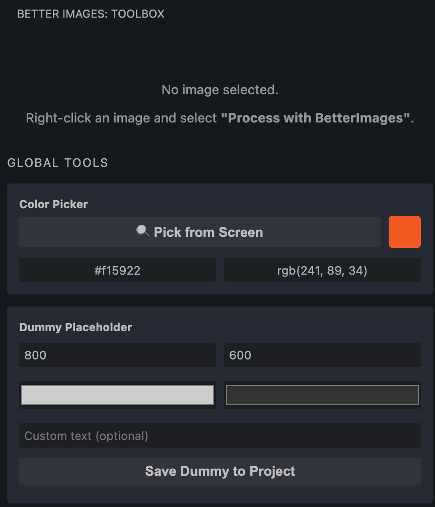
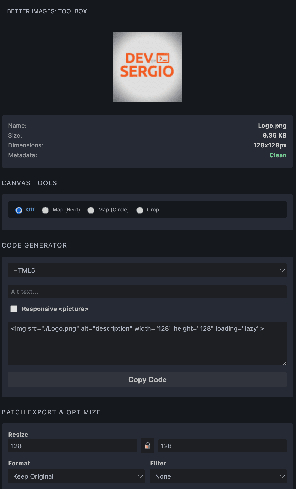

# BetterImages

**BetterImages** is a local image optimization and code generation toolbox for frontend developers working inside VS Code.

It helps you inspect, resize, convert, crop, generate snippets, create placeholders, and prepare image assets without sending your files to external services.

## What's New in 1.4

- Redesigned sidebar with clearer sections for selected-image tools and global tools.
- Global tools are always available, including Dummy Placeholder and Color Picker.
- Export presets for common frontend assets: Thumbnail, Avatar, Hero, and Open Graph image.
- Export result feedback with before/after size and saved percentage.
- Safer exports that avoid overwriting existing files by generating unique names.
- Improved resize behavior with `inside`, `contain`, `cover`, and `fill` modes.
- Quick snippet copy buttons for Markdown, CSS background, HTML, imports, and component code.
- Updated Marketplace icon.
- Updated tooling, tests, packaging scripts, and dependency audit cleanup.

## Key Features

### Image Export & Optimization

Powered by `sharp`, BetterImages can process images locally in your workspace.

- Convert images to **WebP** or **AVIF**.
- Resize with aspect-ratio lock and explicit fit modes.
- Apply filters: grayscale, sepia, blur, and negate.
- Strip metadata when you want smaller, cleaner assets.
- Use ready-made presets for thumbnails, avatars, hero images, and Open Graph images.
- See the optimization result after export, including before/after file size.

### Framework-Aware Code Generation

Select an image and generate production-friendly snippets for common frontend stacks:

- HTML5
- React JSX
- Next.js `Image`
- Vue
- Nuxt `NuxtImg`
- Angular
- Astro assets

You can also copy focused snippets for:

- Markdown image syntax
- CSS `background-image`
- Plain HTML ``
- Imports only
- Component only

### Interactive Canvas Tools

Draw directly over the selected image preview.

- **Image Map Generator:** draw rectangles or circles and generate `<map>` / `<area>` HTML.
- **Crop Tool:** drag a crop area and save a cropped copy back into your workspace.

### Global Developer Tools

These tools are available even before selecting an image:

- **Dummy Placeholder:** generate SVG placeholder images with custom size, background, text color, and label.
- **Color Picker:** pick a color from the screen and copy HEX or RGB values.

When an image is selected, you also get:

- **Favicon Generator:** create `16x16`, `32x32`, and `180x180` icons and copy the HTML tags.
- **Base64 Converter:** copy the selected image as a Base64 Data URI.

## How to Use

1. Open a workspace in VS Code.
2. Right-click an image file in the Explorer.
3. Select **Process with BetterImages**.
4. Use the BetterImages sidebar to export, crop, generate code, or copy asset snippets.

Supported image context menu extensions include `.jpg`, `.jpeg`, `.png`, `.svg`, `.gif`, `.webp`, and `.avif`.

## Screenshots

### Toolbox Overview



### Interactive Canvas & Crop



## Privacy

BetterImages works locally.

- No telemetry.
- No image uploads.
- No external processing.
- Image conversion, cropping, metadata handling, and placeholder generation run on your machine.

## Development

```bash
npm install
npm run compile
npm run lint
npm test
```

Package target-specific VSIX builds:

```bash
npm run package:darwin-arm64
npm run package:darwin-x64
npm run package:linux-x64
npm run package:win32-x64
```

Target-specific packages are recommended because the extension uses native `sharp` binaries.

## License

This project is licensed under the [MIT License](LICENSE).
